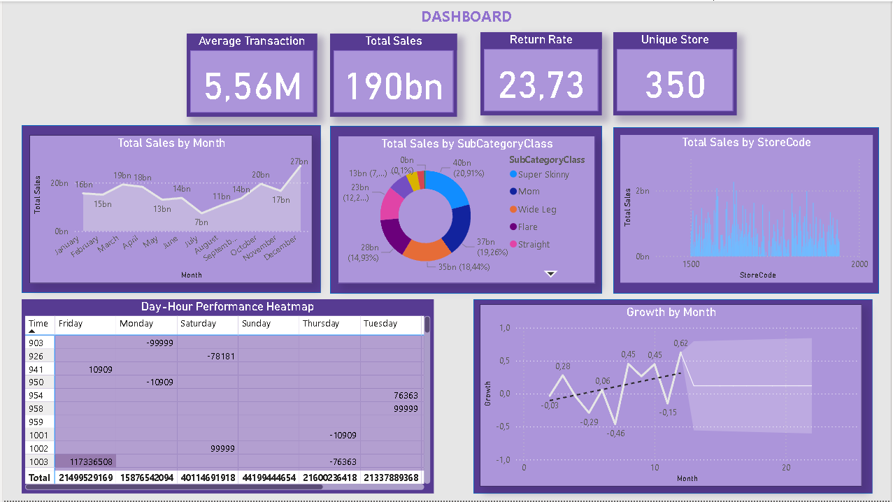

# Power-BI-Dashboard

📄 README.md
# Retail Sales Analytics & Dashboard (Mavi)

A compact end-to-end analytics project that cleans raw retail data, engineers features, and produces both **Python EDA outputs** and a **Power BI dashboard**.



---

## 🔍 What’s Inside

- **Data cleaning & enrichment** for `mavi.xlsx` (Sales & Products sheets), with calculated fields such as `DateCleaned`, `YearMonth`, `IsReturn`, `IsWeekend`, category paths, and more.  
- **Exploratory Data Analysis (EDA)**: monthly/quarterly trends, growth, store & category performance, discount analysis, anomalies/outliers, and action items.  
- **Interactive dashboard** built in **Power BI** (`mavi.pbix`) to visualize key KPIs and trends.

---

## 🧭 Repository Structure


.
├── mavi.xlsx # Raw input data (Sales, Products)
├── mavi.py # Data cleaning & feature engineering pipeline (writes cleaned CSVs)
├── veri_analizi.py # EDA pipeline (reads cleaned CSVs; prints insights)
├── sales_cleaned.csv # Cleaned sales (generated)
├── products_cleaned.csv # Cleaned products (generated)
├── mavi.pbix # Power BI dashboard file
├── mavi.png # Dashboard preview image
└── README.md


> Run order: **mavi.py ➜ veri_analizi.py ➜ open mavi.pbix**

---

## ⚙️ Setup

```bash
# 1) Create & activate a virtual environment (optional but recommended)
python -m venv .venv
# Windows
.venv\Scripts\activate
# macOS/Linux
source .venv/bin/activate

# 2) Install dependencies
pip install -r requirements.txt

▶️ Usage
1) Clean & Prepare Data

Reads mavi.xlsx (Sales & Products) and writes sales_cleaned.csv and products_cleaned.csv with rich date fields, weekend flags, absolute quantities, return flags, English category fills, and full category paths.

python mavi.py

2) Run EDA

Prints KPI summaries (total revenue, avg transaction, unique stores/products), monthly/quarterly trends & growth, store and category leaderboards, discount stats, and outlier/anomaly detection.

python veri_analizi.py


The script outputs:

Monthly/quarterly trend tables & growth rates

Store/category performance rankings

Weekend vs weekday contribution

Top hours, discount ratios, anomaly days

Actionable recommendations

3) Explore the Dashboard

Open mavi.pbix in Power BI Desktop and refresh. The report includes:

Average Transaction, Total Sales, Return Rate, Unique Store

Total Sales by Month, by SubCategoryClass, by StoreCode

Day-Hour Performance heatmap

Growth by Month

📊 Key KPIs & Definitions

Total Sales: Sum of positive sales amounts (returns excluded in most views).

Average Transaction: Mean Amount across transactions.

Return Rate: Share of transactions (or value) flagged as returns (IsReturn=True).

Unique Store: Distinct StoreCode count.

🗂 Data Notes

Raw input: mavi.xlsx with Sales and Products sheets.

Generated: sales_cleaned.csv, products_cleaned.csv.

Merging keys: ProductCode, StoreCode, and date keys like YearMonth.

✅ Repro Checklist

Place mavi.xlsx at repo root.

Run python mavi.py → generates cleaned CSVs.

Run python veri_analizi.py → prints EDA insights.

Open mavi.pbix (Power BI Desktop) → refresh to bind to CSVs.

📦 Suggested Requirements

See requirements.txt.

📝 License

This project is for educational & portfolio purposes. Please do not redistribute the raw data without permission.

🙋‍♂️ Author

Boran Boysan
